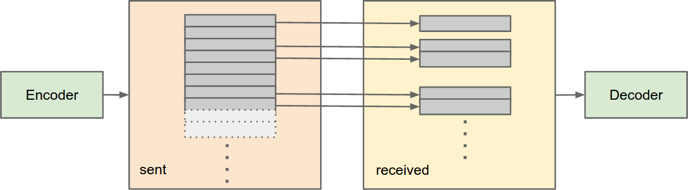

.. _tutorial:

Tutorial
========

This tutorial will demonstrate different features of Kodo and
show how it can be used to encode and decode data.
It consists of the following subsections, each describing different examples:

* :ref:`_the_basics` An example showing the basic functionality of
  Kodo.
* An example with loss,
* An example without systematic coding,
* An example using recoding,
* An example using seed codes, and finally
* An example show how to extend a Kodo stack with additional layers.

.. _the_basics:
The Basics
----------

In the following, we will walk through the process of creating an
encoder and a decoder for a single buffer of data. We will start from
an empty file and slowly expand it. Once we have a working example, we
will modify it in a number of steps to show different properties and
features of the erasure correcting codes and the library.

Our starting point will be the following:

.. literalinclude:: ../../examples/tutorial/empty.cpp
    :language: c++
    :linenos:

Kodo implements a number of different erasure correcting codes. In
this example, we have chosen to use a particular version of a RLNC
(Random Linear Network Code) located in the following header file:

.. literalinclude:: ../../examples/tutorial/empty.cpp
    :language: c++
    :start-after: //! [0]
    :end-before: //! [1]
    :linenos:

The Full RLNC is one of the most common RLNC variants, and provides
several of the advantages that RLNCs have over traditional erasure
correcting codes.  However, for the time being we will just use it as
a standard erasure correcting code, namely to encode and decode some
data.

In the following, we will go through three of the key-parameters to
choose when configuring an erasure correcting code:

* The number of ``symbols``
* The ``symbol_size``
* The finite field, or more specifically the field size used.

In general if a block of data is to be encoded, it's split into a number of
:ref:`symbols <symboĺ>` of a specific size. If you multiply the number of
symbols with the symbol size, you get the total amount of data in bytes that
will be either encoded or decoded per :ref:`generation <generation>`.

.. note:: Sizes in Kodo are always measured in bytes. So if you see a
          variable or function name that includes the word "size",
          bytes is the unit used.

.. note:: In network applications, a single symbol typically
          corresponds to a single packet (for example, a UDP
          datagram).

Let us briefly outline the impact of changing the three parameters.

Number of Symbols
.................

Denotes the number of symbols in a block/generation. Increasing this
number will have the following effects:

* The computational complexity will increase, and can therefore slow
  down the encoding/decoding.
* For some variants of RLNC, the per-:ref:`packet<coded_packet>`
  overhead will increase due to added coding coefficients.
* The per-symbol decoding delay will become larger. The reason for
  this is that when we increase the number of symbols that are encoded
  the decoder has to receive more symbols before decoding.
* The protocol complexity can be decreased. If the number of symbols
  is increased so that all the data which is to be encoded can fit in
  a single generation, the protocol will only have to handle a single
  generation.  If multiple generations are needed, the receivers will
  have to tell from which generations the server should send data, and
  hence increasing the complexity of the protocol.
* The need for a high field size decreases (which is an advantage
  since, in short, a higher field size leads to higher complexity).
  The reason for this is that when the decoder is only missing a few
  symbols, the chance for it to receive a *useful* encoded symbol
  decreases.  This reduction depends on the field size (higher is
  better). You pay this price at each generation, but if a generation
  contains many symbols this issue becomes smaller. Furthermore with
  many symbols, the generations will be bigger, and hence fewer
  generations are needed.

Symbol Size
...........

Denotes the size of each symbol in bytes. The choice of symbol size
typically depends on the application. For network applications we may
choose the symbol size according to the network MTU (Maximum Transfer
Unit) so that datagrams do not get fragmented as they traverse the
network. In those cases symbols sizes are typically around 1300-1400
bytes. On the other hand for storage applications the symbol size is
typically much larger, e.g., in the order of several megabytes.

Field Size
..........

The field size determines the core mathematics. Most erasure
correcting codes are based on :ref:`finite fields<finite_field>`.

* Increasing the field size will increase the probability of
  successful decoding.
* However it will typically also lead to increased computational
  complexity which results in slower applications.

We're now ready to look at the next example. Building on the previous
and very limited example, we extend this in a step by step manner to
finally end up with something that resembles the following:

.. literalinclude:: ../../examples/tutorial/basic.cpp
    :language: c++
    :linenos:

Initially we define the two parameters number of ``symbols`` and the
``symbol_size``.

.. literalinclude:: ../../examples/tutorial/basic.cpp
    :language: c++
    :start-after: //! [0]
    :end-before: //! [1]
    :linenos:

In the given example the following two lines selects the field size
for both the encoder and decoder.

.. literalinclude:: ../../examples/tutorial/basic.cpp
    :language: c++
    :start-after: //! [1]
    :end-before: //! [2]
    :linenos:

As shown above this is done by passing a type defining the finite
field, as the first argument to the chosen encoder and decoder. Since
fast finite field computations are not only useful in erasure
correcting codes this part of the functionality has be split into a
second library called `Fifi <https://github.com/steinwurf/fifi>`_. The
Fifi library defines a number of different finite fields such as
``binary``, ``binary4``, ``binary8``, and ``binary16``. To switch
between the different field you can simple replace ``fifi::binary8``
with one of the other field types e.g. ``fifi::binary``.

Once the key parameters have been selected we are ready to create an
encoder and a decoder to perform the actual coding.

.. literalinclude:: ../../examples/tutorial/basic.cpp
    :language: c++
    :start-after: //! [2]
    :end-before: //! [3]
    :linenos:

The encoder and decoder types define a nested type called the
``factory``. Using the factory we can configure and build encoders and
decoders. We instantiate the factory using chosen number of symbols
and symbol size. Invoking the ``build()`` function will return a
smart-pointer to a new encoder or decoder. In C++ a smart-pointer is
one which behaves just like a normal pointer, but which will delete
the object when there are no more references to it. Typically the
factory type used is a *pooled* factory which means that when an
encoder or decoder is about to be delete instead they will be returned
to a memory pool for reuse. The next call to build will then return
one of the reused encoders/decoders. This type of memory management
increases performance by reducing the number of memory allocations.

Before the encoding and decoding of data can begin, two buffers are
needed.

.. literalinclude:: ../../examples/tutorial/basic.cpp
    :language: c++
    :start-after: //! [3]
    :end-before: //! [4]
    :linenos:

The first buffer is the ``payload`` buffer. Once we start coding this
buffer will contain a single encoded symbol which we can "transmit" to
the decoder.  Besides the encoded symbol data, the payload buffer will
also contain internal meta-data describing how the symbol was
encoded. The format and size of this data depends on the chosen
erasure correcting code. Fortunately we don't have to worry about
that, as long as we provide a buffer large enough. The needed size of
the buffer is returned by the ``payload_size`` call.

The second buffer, ``block_in``, contains the data we wish to
encode. As mentioned earlier the size of this buffer is the number of
symbols multiplied by the symbol size. For convenience we can use the
``block_size`` function to get this value. In this case we are not
encoding real data so we just fill the ``block_in`` buffer with some
randomly generate data.

Once the buffers have been created we can call the ``set_symbols``
function on the encoder to specify which buffer it should encode.

.. literalinclude:: ../../examples/tutorial/basic.cpp
    :language: c++
    :start-after: //! [4]
    :end-before: //! [5]
    :linenos:

Finally we have everything ready to start the coding. This is done in
a loop until the decoding has successfully completed.

.. literalinclude:: ../../examples/tutorial/basic.cpp
    :language: c++
    :start-after: //! [5]
    :end-before: //! [6]
    :linenos:

We use a variable ``encoded_count`` to keep track of the number of
symbols we've encoded. When we finish this number should match the
``symbols``, as all data is passed safely on to the decoder, we shall
later see examples where this is not necessarily the case.  The loop
stops when the decoders ``is_complete`` function returns true. This
happens when all symbols have been decoded.  The encoder encodes into
the payload buffer and returns then number of bytes used during the
encoding, and hence the number of bytes we in theory have to transmit
over the network.  The payload is passed to the decoder which decodes
the encoded data and thereby increases its rank.

When the decoding process is completed, the data can be extracted from
the decoder.

.. literalinclude:: ../../examples/tutorial/basic.cpp
    :language: c++
    :start-after: //! [6]
    :end-before: //! [7]
    :linenos:

To do so, a buffer is created and the decoded data is copied to it
using the ``copy_symbols`` function.

Simulating Losses
-----------------
.. _simulating_losses:

In this example we will expand the previous basic example by adding
some loss.  This can be done simply by not "transmitting" encoded
symbol to the decoder.  The complete example is shown below.

.. literalinclude:: ../../examples/tutorial/add_loss.cpp
    :language: c++
    :linenos:

As the attentive reader might notice, only the coding loop is changed
from the basic example.

.. literalinclude:: ../../examples/tutorial/add_loss.cpp
    :language: c++
    :start-after: //! [0]
    :end-before: //! [1]
    :linenos:

The change is fairly simple. We introduce a 50% loss using ``rand() %
2`` and add a variable ``dropped_count`` to keep track of the dropped
symbols.

The encoder can, in theory, create an infinite number of
packages. This is a feature called rate-less which is unique to
network coding. This means that as long as the loss is below 100% the
decoder will be able to finish the decoding.

A graphical representation of the setup is seen in the figure below.

Running the example will result in the following output (the output
will always be the same as the random function is never seeded):

.. code-block:: none

    Bytes used = 1405
    Bytes used = 1405
    Bytes used = 1405
    Bytes used = 1405
    Bytes used = 1405
    Bytes used = 1405
    Bytes used = 1405
    Bytes used = 1405
    Bytes used = 1405
    Bytes used = 1405
    Bytes used = 1405
    Bytes used = 1405
    Bytes used = 1405
    Bytes used = 1405
    Bytes used = 1405
    Bytes used = 1405
    Bytes used = 1417
    Bytes used = 1417
    Bytes used = 1417
    Bytes used = 1417
    Bytes used = 1417
    Bytes used = 1417
    Bytes used = 1417
    Bytes used = 1417
    Bytes used = 1417
    Bytes used = 1417
    Bytes used = 1417
    Encoded count = 27
    Dropped count = 11

An interesting thing to notice is the number of bytes used. It
increases slightly after the encoder has encoded 16 symbols (the same
number as the number of symbols in the generation). This is because
the encoder exits the systematic phase where it sends the symbols
uncoded. This technique will be explained in following example.

Turn Off Systematic Coding
--------------------------
.. _turn_off_systematic_coding:

A simple, yet clever technique called systematic encoding can be used
to improve the performance of network coding. The way it works is to
initially send everything uncoded, and then start the encoding.  The
benefit of this is that as the receivers initially has no data, all
data will be useful for them. So if the symbols are safely received by
the decoder, it can get the data "for free" without the need for
decoding.  The Kodo library has built-in support for this
approach. The sample code, for this is again build based on the basic
example.

.. literalinclude:: ../../examples/tutorial/turn_systematic_off.cpp
    :language: c++
    :linenos:

What's added in this example here is the use of ``is_systematic_on`` and
``set_systematic_off``.

.. literalinclude:: ../../examples/tutorial/turn_systematic_off.cpp
    :language: c++
    :start-after: //! [0]
    :end-before: //! [1]
    :linenos:

Initially Kodo's Full RLNC encoder has the systematic phase enabled
per default.  As seen in the previous example, this is automatically
turned off when all symbols has been send once. In this example we
turn off the systematic phase before entering the coding loop. This
can easily seen from the output when running the example:

.. code-block:: none

    Bytes used = 1417
    Bytes used = 1417
    Bytes used = 1417
    Bytes used = 1417
    Bytes used = 1417
    Bytes used = 1417
    Bytes used = 1417
    Bytes used = 1417
    Bytes used = 1417
    Bytes used = 1417
    Bytes used = 1417
    Bytes used = 1417
    Bytes used = 1417
    Bytes used = 1417
    Bytes used = 1417
    Bytes used = 1417
    Bytes used = 1417
    Bytes used = 1417
    Bytes used = 1417
    Bytes used = 1417
    Bytes used = 1417
    Bytes used = 1417
    Bytes used = 1417
    Bytes used = 1417
    Bytes used = 1417
    Bytes used = 1417
    Bytes used = 1417
    Encoded count = 27
    Dropped count = 11

Here the bytes used is always the same as all the symbols are encoded
by the encoder.  For most use cases the systematic phase is
beneficial. However it should be avoided if

* The state of receivers is unknown. If that's the case, using the
  systematic approach might result in sending redundant data, as the
  receivers might already have some of the data.
* The setup has multiple sources. If this is the case, the sources
  should not send the same data, as this can be redundant for the
  receivers.

Recoding Data
-------------
.. _recoding_data:

One of the key features of RLNC is the ability to recode. What this
means is if the data is to be transmitted through a chain of nodes,
the data can be reencoded at each node.  A examples of such networks
include:

* Relay networks
* P2P networks, and
* multi-path networks

The complete example code for this is as follows.

.. literalinclude:: ../../examples/tutorial/recoding.cpp
    :language: c++
    :linenos:

Again only a few lines has changed from the basic example. We've
changed the setup a bit so that we now have two instead of one
decoder.  In the example the ``encoder`` encodes and sends data to
``decoder1``.  This data is then decoded and further recoded by
``decoder1`` and then finally sent to ``decoder2`` where it's decoded.

.. literalinclude:: ../../examples/tutorial/recoding.cpp
    :language: c++
    :start-after: //! [0]
    :end-before: //! [1]
    :linenos:

The advantage of this is that if a loss

Using Seed Codes
----------------
.. _using_seed_codes:

.. literalinclude:: ../../examples/tutorial/seed_codes.cpp
    :language: c++
    :linenos:

Purpose/Advantage

* reduce overhead by adding coding coefficients

Disadvantage

* Does not support recoding
* Does not on-the-fly or sliding-window

Adding a New Layer
------------------
.. _adding_a_new_layer:

Kodo is a set of building blocks rather than one specific code. It is
meant to be modified.

Use-cases:

* You want to change which symbols are included based on receiver
  feedback.
* You want to track the time elapsed since a specific decoder last
  received a packet.
* You want to collect statistics about the decoding
* You want to encode and decode using a sliding window

Mixin-Layers / Parameterized Inheritance
........................................

In this context a mixin is not a stand-alone class but represents a
"slice" of functionality.  The slices are then combined to compose the
final functionality.  In C++ we do this through templates.  Kodo
heavily relies on this technique.

* Flexibility
* Performance

Template
^^^^^^^^

.. code-block:: c++
    :linenos:

    template<class T>
    class foo
    {
    public:
        T m_t;
    };

    foo<int> f1;
    foo<my_other_type> f2;

Mixin-Layers
^^^^^^^^^^^^

.. code-block:: c++
    :linenos:

    template<class Super>
    class add_layer : public Super
    {
    public:

        int add(int a, int b)
        {
            return a + b;
        }
    };

    class final_layer
    { };

    class calculator
        : public add_layer<final_layer> >
    { };

Main

.. code-block:: c++
    :linenos:

    int main()
    {
        calculator calc;
        std::cout << calc.add(4,2) << std::endl;
        return 0;
    }

output
6

Adding functionality

.. code-block:: c++
    :linenos:

    template<class Super>
    class sub_layer : public Super
    {
    public:

        int subtract(int a, int b)
        {
            return a - b;
        }
    };

    class calculator
        : public sub_layer<
                     add_layer<final_layer> >
    { };

Main2

.. code-block:: c++
    :linenos:

    int main()
    {
        calculator calc;
        std::cout << calc.add(4,2) << std::endl;
        std::cout << calc.subtract(2,5) << std::endl;
        return 0;
    }

output
6
-3

Customization of layers

.. code-block:: c++
    :linenos:

    template<class Super>
    class modulo_layer : public Super
    {
    public:

        int add(int a, int b)
        {
            return Super::add(a,b) % 5;
        }

        int subtract(int a, int b)
        {
            int res =
                Super::subtract(a,b) % 5;
            return res < 0 ? res + 5 : res;
        }
    };

    class calculator
        : public modulo_layer<
                 sub_layer<
                 add_layer<final_layer> > >
    { };

Main3

.. code-block:: c++
    :linenos:

    int main()
    {
        calculator calc;
        std::cout << calc.add(2,2) << std::endl;
        std::cout << calc.subtract(2,2) << std::endl;
        return 0;
    }

output

1
2

Adding a Layer
..............

.. literalinclude:: ../../examples/tutorial/add_layer.cpp
    :language: c++
    :linenos:

link hacking kodo

.. source: http://sphinx-doc.org/markup/code.html#includes
